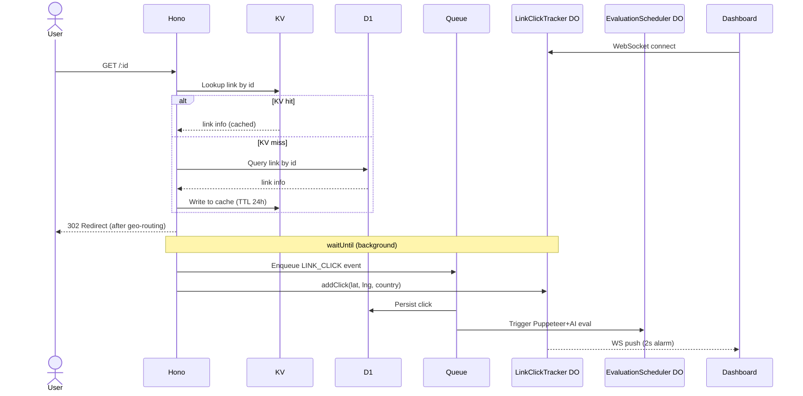

# Full-Stack on Cloudflare

A full-stack link management and analytics platform built entirely on Cloudflare's developer platform. Create smart links with multiple destinations, track clicks in real time on a geo-aware dashboard, and automatically evaluate destination health using AI.

## Features

- **Link management** — create links with multiple destinations and manage them from a single dashboard
- **Real-time analytics** — live click tracking via WebSockets with geo data (country, region, coordinates)
- **AI destination evaluation** — automated health checks using Cloudflare Puppeteer + Workers AI; surfaces problematic destinations on the dashboard
- **Authentication** — user accounts powered by Better Auth with Stripe integration

## Tech Stack

**Frontend**

- React 19, TanStack Router, TanStack Query
- tRPC (end-to-end type-safe API)
- Tailwind CSS v4, Radix UI, Zustand

**Backend (Cloudflare Workers)**

- Hono.js, tRPC
- Drizzle ORM + Cloudflare D1 (SQLite)
- Cloudflare KV, R2, Queues, Durable Objects, Workflows
- Cloudflare Puppeteer + Workers AI
- Better Auth + Stripe

## Architecture

The project is a pnpm monorepo with two Workers and a shared package:

```
apps/user-application/   # React SPA served as static assets + tRPC API Worker
apps/data-service/       # Backend Worker (AI, Durable Objects, Queues, Workflows)
packages/data-ops/       # Shared DB schema, queries, Zod schemas
```

**How it fits together:**

1. The `user-application` Worker serves the React SPA and handles all tRPC calls via Hono.js.
2. For heavy operations, it forwards requests to `data-service` via a Cloudflare **service binding** (`BACKEND_SERVICE`).
3. Link clicks are written to a **Queue**, which the `data-service` processes asynchronously and stores in D1.
4. A **`LinkClickTracker` Durable Object** maintains live WebSocket connections per account and pushes a sliding window of clicks every 2 seconds.
5. Destination health checks run as **Cloudflare Workflows**: Puppeteer scrapes the page → Workers AI analyses content → results saved to R2 and D1. The `EvaluationScheduler` Durable Object drives these via alarms.

## Link Click Flow

When a user opens a short link, the following happens:



## Getting Started

**Prerequisites:** Node.js 18+, pnpm, a Cloudflare account with D1 / KV / Workers AI enabled.

```bash
# Install dependencies
pnpm i

# Build the shared package (required before running the frontend)
pnpm run build-package

# Start the frontend dev server (localhost:3000)
pnpm run dev-frontend

# Start the data-service dev server (in a separate terminal)
pnpm run dev-data-service
```

### Database setup

```bash
cd packages/data-ops

# Apply migrations to Cloudflare D1
pnpm run migrate

# (Optional) Open Drizzle Studio to inspect data
pnpm run studio
```
